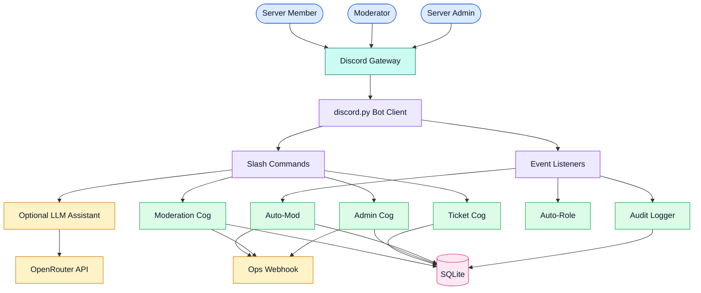

# Discord Moderation Bot

[](https://www.python.org/)
[](https://discordpy.readthedocs.io/)
[](https://www.sqlite.org/)
[](https://openrouter.ai/)
[](https://www.freedesktop.org/software/systemd/man/latest/systemd.service.html)

Discord Moderation Bot is a Python moderation assistant for community servers. It combines slash-command moderation, auto-moderation, tickets, auto-role, audit logging, a SQLite-backed case history, and optional LLM-powered moderation assistance.

## Demo

[Live demo video](https://youtu.be/f7ZKzBm6PHg) — capability overview and a moderation workflow simulation (spam burst detection, warning ladder, SQLite-logged action).

## Overview

The bot is designed for Discord communities that need structured moderation without depending on a large third-party moderation suite. Moderators can use slash commands for manual actions, while automated listeners detect common moderation incidents such as spam bursts, mass mentions, and profanity.

The project also includes safe demo commands, ops webhook forwarding, and an optional OpenRouter-powered assistant for moderation questions.

## Features

| Feature | Details |
| --- | --- |
| Moderation ladder | Warning-based escalation with timeouts, kicks, bans, and pardon support. |
| Slash commands | Commands for help, status, warnings, tickets, config, demo incidents, and moderation actions. |
| Auto-moderation | Detects spam bursts, mass mentions, invite-style abuse, and profanity patterns. |
| Ticket system | Creates private support/moderation ticket channels. |
| Auto-role | Assigns configured roles when members join. |
| Audit logging | Sends moderation actions and incidents to a configured log channel. |
| SQLite case history | Stores warnings, mod logs, tickets, and configuration locally. |
| Ops webhook | Posts selected moderation events to an external dashboard. |
| Optional LLM assistant | Uses OpenRouter to answer moderation and server-ops questions when configured. |
| Safe demo workflow | `/demo_incident` simulates incidents without punishing members. |

## System design



### Runtime flow

| Step | Component | Responsibility |
| --- | --- | --- |
| 1 | Discord Gateway | Receives member messages, slash commands, and server events. |
| 2 | `discord.py` bot | Routes interactions to commands and event listeners. |
| 3 | Cogs | Separate moderation, tickets, admin, auto-role, auto-mod, and logging behavior. |
| 4 | SQLite | Stores warning history, mod logs, tickets, and server configuration. |
| 5 | Optional OpenRouter assistant | Answers moderation questions through `/ask` or bot mentions. |
| 6 | Ops webhook | Mirrors selected moderation events to an external dashboard. |

## Tech stack

| Layer | Choice | Notes |
| --- | --- | --- |
| Runtime | Python 3.11+ | Main bot runtime. |
| Discord framework | `discord.py` 2.x | Slash commands, events, cogs, member intents, and message handling. |
| Database | SQLite via `aiosqlite` | Local persistence for warnings, config, tickets, and logs. |
| Configuration | `python-dotenv` | Loads root and local `.env` files. |
| AI assistant | OpenRouter | Optional moderation assistant, not required for core bot features. |
| Deployment | systemd on Ubuntu | Long-running service with restart behavior. |

## Slash commands

| Command | Audience | Purpose |
| --- | --- | --- |
| `/help` | Members and moderators | Shows available bot commands. |
| `/status` | Members and moderators | Confirms the bot is online. |
| `/ask` | Moderators/admins | Ask the optional moderation assistant a question. |
| `/demo_incident` | Moderators/admins | Run a safe moderation simulation. |
| `/warn` | Moderators | Add a warning and apply the warning ladder. |
| `/pardon` | Moderators | Remove the latest active warning. |
| `/kick` | Moderators | Kick a member. |
| `/ban` | Moderators | Ban a member. |
| `/mute` / `/unmute` | Moderators | Apply or remove a timeout. |
| `/purge` | Moderators | Bulk-delete messages. |
| `/ticket` / `/ticket_close` | Members and moderators | Open or close moderation/support tickets. |
| `/config` | Admins | Configure log channels, auto-role, and moderation thresholds. |

## Quick start

Clone the repository and create a virtual environment:

```bash
git clone https://github.com/brusnyak/discord-mod-bot.git
cd discord-mod-bot
python3 -m venv .venv
source .venv/bin/activate
```

Install dependencies:

```bash
pip install -r requirements.txt
```

Create an environment file:

```bash
cp .env.example .env
```

Set the required values:

```env
DISCORD_BOT_TOKEN=your-discord-bot-token
TEST_GUILD_ID=your-test-server-id
BOT_OPS_WEBHOOK_URL=http://127.0.0.1:4317/webhooks/discord
OPENROUTER_API_KEY=optional-openrouter-key
OPENROUTER_MODEL=openrouter/free
```

Run the bot:

```bash
python -m main
```

## Environment variables

| Variable | Required | Default | Description |
| --- | --- | --- | --- |
| `DISCORD_BOT_TOKEN` | Yes | None | Bot token from the Discord Developer Portal. |
| `TEST_GUILD_ID` | No | None | Guild ID for faster test-server slash command sync. |
| `BOT_OPS_WEBHOOK_URL` | No | None | Optional external ops dashboard webhook. |
| `OPENROUTER_API_KEY` | No | None | Enables the moderation assistant. |
| `OPENROUTER_MODEL` | No | `openrouter/free` | Model used by the optional assistant. |

## Production deployment

The repository includes a systemd service file for Ubuntu-style deployment.

```bash
sudo cp deploy/discord-bot.service /etc/systemd/system/
sudo systemctl daemon-reload
sudo systemctl enable --now discord-bot
```

Useful service commands:

```bash
sudo systemctl status discord-bot
sudo journalctl -u discord-bot -f
sudo systemctl restart discord-bot
```

Before deploying, confirm the paths inside `deploy/discord-bot.service` match your server directory.

## Project structure

```text
discord-mod-bot/
├── main.py              # Entry point, bot setup, built-in commands
├── config.py            # Environment-based configuration
├── ops_webhook.py       # External dashboard event posting
├── cogs/
│   ├── moderation.py    # Warn, kick, ban, mute, pardon ladder
│   ├── admin.py         # Setup, config, purge
│   ├── automod.py       # Spam, mass mention, and profanity detection
│   ├── tickets.py       # Ticket open/close/claim flows
│   ├── autorole.py      # Join role assignment
│   └── logging_cog.py   # Audit logging
├── utils/
│   ├── checks.py        # Permission helpers
│   └── formatting.py    # Embed builders
├── db/
│   ├── db.py            # SQLite connection and queries
│   └── schema.sql       # Database schema
└── deploy/              # systemd service file
```

## README style direction

This repository follows the shared portfolio README structure:

- Short product description at the top.
- Technology labels for fast scanning.
- Feature and command tables for structured reading.
- Coloured system design diagram when architecture is useful.
- Practical setup, configuration, deployment, and project structure sections.

## License

No license file is currently included in this repository.
